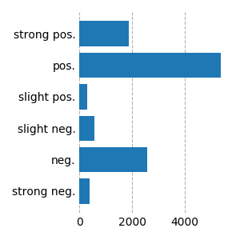

# NoReC_fine

This dataset is based largely on the original data described in the paper _A Fine-Grained Sentiment Dataset for Norwegian_ by L. Øvrelid, P. Mæhlum, J. Barnes, and E. Velldal, accepted at LREC 2020, [paper available](https://www.aclweb.org/anthology/2020.lrec-1.618). However, we have since added annotations for another 3476 sentences, increasing the overall size and scope of the dataset.

## Overview
While the previously released dataset [NoReC_eval](https://github.com/ltgoslo/norec_eval) labeled sentences as to whether they are _evaluative_ or sentiment-bearing, NoReC_fine expands on these annotations by labeling _polar expressions_, _opinion holders_ and _opinion targets_. This data comprises roughly 11,000 sentences across more than 400 reviews and 10 different thematic categories (literature, products, restaurants, etc.), taken from  a subset of the [Norwegian Review Corpus](https://github.com/ltgoslo/norec) (NoReC; [Velldal et al. 2018](http://www.lrec-conf.org/proceedings/lrec2018/pdf/851.pdf)). The data comes with a predefined train/dev/test split (inherited from NoReC), and some key statistics are summarized in the table below, including frequency counts and average token lengths.     

| Type              | Train  | Dev    | Test     |  Total  |
| :--------         |-------:|-------:|-------:  |-------: |
| Sentences         |   8634 |   1531  |    1272 |   11437 |
| --- avg. len      | 16.7   | 16.9    |    17.2 |   16.8  |
| Holders           |   898  |     120 |     110 |    1128 |
| --- avg. len      |   1.1  |     1.0 |     1.0 |    1.1  |
| Targets           |   6778 |    1152 |    993  |   8923  |
| --- avg. len      |   1.9  |    2.0  |    2.0  |   2.0   |
| --- discontinuous |39      |     5   |    6    |   50    |
| --- Not On Topic  |  971   |     226 |   148   |  1345   |
| Polar Expressions |  8448  |   1432  |    1235 |   11115 |
| --- avg. len      |   4.9  |     5.1 |     4.9 |  4.9    |
| --- discontiuous  |  783   |     131 |    125  |   1039  |


Each opinion is annotated for _polarity_ (positive, negative) and _intensity_ (slight, standard, strong). The distribution is shown in the figure below:




## Annotation guidelines

The full annotation guidelines are distributed with this repo and can be found [here](annotation_guidelines/guidelines.md). A summary can also be found in the [paper](https://www.aclweb.org/anthology/2020.lrec-1.618). 

## Terms of use
NoReC_fine inherits the license of the underlying [NoReC](https://github.com/ltgoslo/norec) corpus, copied here for convenience:

The data is distributed under a Creative Commons Attribution-NonCommercial licence (CC BY-NC 4.0), access the full license text here: https://creativecommons.org/licenses/by-nc/4.0/

The licence is motivated by the need to block the possibility of third parties redistributing the orignal reviews for commercial purposes. Note that **machine learned models**, extracted **lexicons**, **embeddings**, and similar resources that are created on the basis of NoReC are not considered to contain the original data and so **can be freely used also for commercial purposes** despite the non-commercial condition.


## JSON format

Each sentence has a dictionary with the following keys and values:

* 'sent_id': unique NoReC identifier for document + paragraph + sentence which lines up with the identifiers from the document and sentence-level NoReC data

* 'text': raw text

* 'opinions': list of all opinions (dictionaries) in the sentence

Additionally, each opinion in a sentence is a dictionary with the following keys and values:

* "Source": a list of text and character offsets for the opinion holder

* "Target": a list of text and character offsets for the opinion target

* "Polar_expression": a list of text and character offsets for the opinion expression

* "Polarity": sentiment label ("Negative", "Positive")

* "Intensity": sentiment intensity ("Standard", "Strong", "Slight")

* "NOT": Whether the target is 'Not on Topic' (True, False)

* "Target_is_general": (True, False)

* "Type": Whether the polar expression is Evaluative (E) or Evaluative Fact Implied (EFINP)

```
{
    'sent_id': '202263-20-01',
    'text': 'Touchbetjeningen brukes også til å besvare innkomne mobilanrop , og Sennheiser skryter av å ha doble mikrofoner i øreklokkene for å kutte ned på støyen .',
    'opinions': [
                    {
                     'Source': [['Sennheiser'], ['68:78']],
                     'Target': [['øreklokkene'], ['114:125']],
                     'Polar_expression': [['skryter av å ha doble mikrofoner i øreklokkene for å kutte ned på støyen'], ['79:151']],
                     'Polarity': 'Positive',
                     'Intensity': 'Standard',
                     'NOT': False,
                     'Source_is_author': False,
                     'Target_is_general': True,
                     'Type': 'E'
                     }
                 ]
}
```

Note that a single sentence may contain several annotated opinions. At the same time, it is common for a given instance to lack one or more elements of an opinion, e.g. the holder (source). In this case, the value for that element is [[],[]].

## Importing the data
We include train.json, dev.json, and test.json in this directory.

You can import them by using the json library in python:

```
>>> import json
>>> data = {}
>>> for name in ["train", "dev", "test"]:
        with open("{0}.json".format(name)) as infile:
            data[name] = json.load(infile)
```

## Cite
If you use this dataset, please cite the following paper:

```
@InProceedings{OvrMaeBar20,
  author = {Lilja {\O}vrelid and Petter M{\ae}hlum and Jeremy Barnes and Erik Velldal},
  title = {A Fine-grained Sentiment Dataset for {N}orwegian},
  booktitle = {{Proceedings of the 12th Edition of the Language Resources and Evaluation Conference}},
  year = 2020,
  address = "Marseille, France, 2020"
}
```
URL: https://www.aclweb.org/anthology/2020.lrec-1.618/
